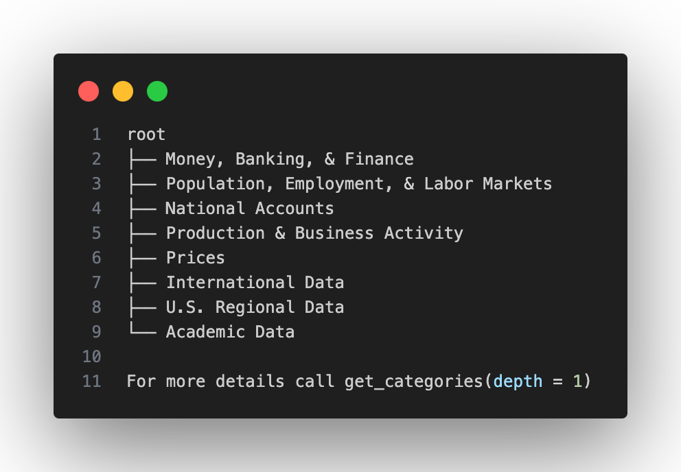
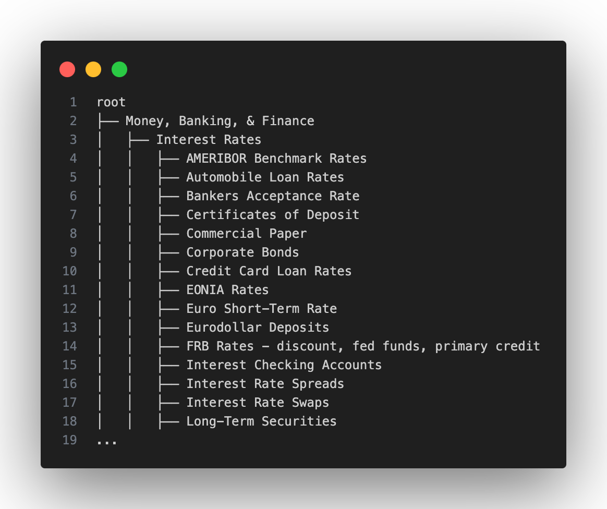
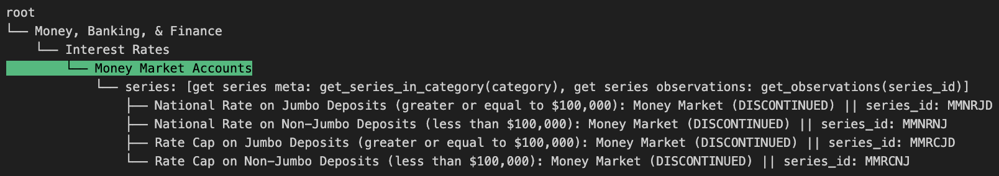
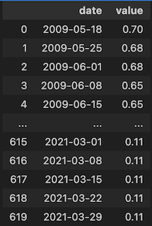

.. image:: https://img.shields.io/badge/version-0.1.0-success.svg?color=blue
   :target: https://pypi.org/project/verstack/

``friendlyfred`` is a python package to query the Federal Reserve Economic Data (`FRED <https://fred.stlouisfed.org/docs/api/fred/>`_).

The package allows for a simple interface to query the FRED database and retrieve data in a tabular format. 

The package also has a built-in functionality to display all the available FRED categories with it's handy ``print_tree()`` method.

Display major categories:

``fred.print_tree(depth = 0)``

Show all categories and their subcategories:

``fred.print_tree(depth = 2)``

Show available series for a category:

``fred.print_tree(category = 'Money Market Accounts')``

Get data for any series:

``fred.get_observations('MMNRJD')``

******************
Installation
******************

  $ ``pip install friendlyfred``

  $ ``pip install --upgrade friendlyfred``

******************
Usage
******************

To use ``friendlyfred``, you need to **get FRED api key** from the FRED website. It's free and quick: go `here <https://research.stlouisfed.org/docs/api/api_key.html>`_, sign up and request an api key.

.. code-block:: python

  from friendlyfred import Fred
  fred = Fred(api_key = 'your_api_key')
  # optionally pass a txt file with api key as an api_key_file argument
  # optionally create an environment variable FRED_API_KEY and it will be sourced automatically

Note 
===========================
``friendlyfred`` contains the full structure of all FRED categories and subcategories which it can display with ``print_tree(depth = 2)`` method without an API key. In order to dive deeper and display the available series for a category (E.g. ``print_tree(category = 'Saving Accounts')``), or to get observations for any series you need to provide an API key.

Methods
===========================
* ``print_tree(depth, category)``

  Print FRED categories and subcategories. If depth is 0, it will display only the major categories. If depth is 2, it will display all the subcategories. If category is provided, it will display the available series for that category.

    Parameters

    - ``depth`` int

        Optional: number of levels of subcategories to display. Default is 0, maximum is 2.

    - ``category`` str or int

        Optional: specific category to display. If category is in the top level (major): this category and it's subcategories are displayed. If category is in the least level (minor subcategory): the full path to this category (parents) and the available series for this category will be displayed.

* ``get_observations(series_id, observation_start, observation_end, frequency)``
    
    Get the data for a specific series.
    
        Parameters
    
        - ``series_id`` str
    
            Required: the series id to get the data for.
    
        - ``observation_start`` str
    
            Optional: the start date for the data. Default is "1776-07-04".
    
        - ``observation_end`` str
    
            Optional: the end date for the data. Default is "9999-12-31".
    
        - ``frequency`` str

            Optional: the frequency of the data. Default is None.

            Frequencies without period descriptions:

                d = Daily
                w = Weekly
                bw = Biweekly
                m = Monthly
                q = Quarterly
                sa = Semiannual
                a = Annual

            Frequencies with period descriptions:

                wef = Weekly, Ending Friday
                weth = Weekly, Ending Thursday
                wew = Weekly, Ending Wednesday
                wetu = Weekly, Ending Tuesday
                wem = Weekly, Ending Monday
                wesu = Weekly, Ending Sunday
                wesa = Weekly, Ending Saturday
                bwew = Biweekly, Ending Wednesday
                bwem = Biweekly, Ending Monday
    
        Returns
    
        - ``pandas.DataFrame``
    
            A pandas DataFrame with the data for the series.

* ``get_categories()``

    Get all the available categories and subcategories.

        Returns

        - ``dict``

            A dictionary with all categories and their children with their respective names, parents ids and children. Does not include the series.

* ``update_categories()``
        
        Update categories and subcategories stored in a local categories.py file. This does not have to be done frequently, because presumably FRED categories are static. Date of the last update is included at the top of the categories.py file, it changes to a new date if updated.
    
        Returns
    
        - ``None``
    
* ``get_subcategories(category)``

    Get subcategories for a specific category.

        Parameters

        - ``category`` str or int

            Required: category name or category id.

        Returns

        - ``dict``

            A dictionary with the subcategories for the category.

* ``get_related_categories(category)``

    Get related categories for a specific category.

        Parameters

        - ``category`` str or int

            Required: category name or category id.

        Returns

        - ``dict``

            A dictionary with the related categories for the category.

* ``get_series_in_category(category, discontinued, limit, order_by, sort_order, filter)``

    Get metadata on all series available in a specific category.

        Parameters

        - ``category`` str or int

            Required: category name or category id.

        - ``discontinued`` bool

            Optional: whether to include discontinued series. Default is True.

        - ``limit`` int

            Optional: the number of series to return. Default is 1000.

        - ``order_by`` str

            Optional: order results by values of the specified attribute.
            One of the following strings: 'series_id', 'title', 'units', 'frequency', 'seasonal_adjustment', 'realtime_start', 'realtime_end', 'last_updated', 'observation_start', 'observation_end', 'popularity', 'group_popularity'.
            Default: 'series_id'

        - ``sort_order`` str

            Optional: sort order of the results.
            One of the following strings: 'asc', 'desc'.
            Default: asc

        - ``filter`` str

            Optional: filter results by values of the specified attribute.
            Two item tuple: (filter_variable, filter_value)
            One of the following strings: 'frequency', 'units', 'seasonal_adjustment'.
            Default: None
            Example: ('seasonal_adjustment', 'Not Seasonally Adjusted')

        Returns

        - ``pandas.DataFrame``

            Dataframe containing all series in a given category and their respective attributes:
            ['id', 'realtime_start', 'realtime_end', 'title', 'observation_start', 'observation_end', 'frequency', 'frequency_short', 'units', 'units_short', 'seasonal_adjustment', 'seasonal_adjustment_short', 'last_updated', 'popularity', 'group_popularity', 'notes']

* ``search(search_text, discontinued, limit, order_by, sort_order, filter)``

    Search FRED database for series related to seach_text.

        Parameters

        - ``search_text`` str

            Required: search query.

        - ``discontinued`` bool

            Optional: whether to include discontinued series. Default is True.

        - ``limit`` int

            Optional: the number of series to return. Default is 1000.

        - ``order_by`` str

            Optional: order results by values of the specified attribute.
            One of the following strings: 'search_rank', 'series_id', 'title', 'units', 'frequency', 
                                    'seasonal_adjustment', 'realtime_start', 'realtime_end', 
                                    'last_updated', 'observation_start', 'observation_end', 
                                    'popularity', 'group_popularity'.
            Default: 'search_rank'

        - ``sort_order`` str

            Optional: sort order of the results.
            One of the following strings: ``'asc'``, ``'desc'``.
            Default: asc

        - ``filter`` str

            Optional: filter results by values of the specified attribute.
            Two item tuple: (filter_variable, filter_value)
            One of the following strings: 'frequency', 'units', 'seasonal_adjustment'.
            Default: None
            Example: ('seasonal_adjustment', 'Not Seasonally Adjusted')

        Returns

        - ``pandas.DataFrame``

            Dataframe containing all series in a given category and their respective attributes:
            ['id', 'realtime_start', 'realtime_end', 'title', 'observation_start', 'observation_end', 'frequency', 'frequency_short', 'units', 'units_short', 'seasonal_adjustment', 'seasonal_adjustment_short', 'last_updated', 'popularity', 'group_popularity', 'notes']

* ``get_category_meta(category)``
        
        Get metadata for a specific category.
    
            Parameters
    
            - ``category`` str or int
    
                Required: category name or category id.
    
            Returns
    
            - ``dict``
    
                A dictionary with the metadata for the category.

* ``get_series_meta(series_id)``
            
        Get metadata for a specific series.
        
            Parameters
    
            - ``series_id`` str
    
                Required: series id.
    
            Returns
    
            - ``dict``
    
                A dictionary with the metadata for the series.

Development
-----------

I welcome new contributors of all experience levels. ``friendlyfred`` community goals are to be helpful, welcoming, and effective.
`Development Guide <https://scikit-learn.org/stable/developers/index.html>`_
based on scikit-learn best practices has detailed information about contributing code, documentation, tests, and more. 

Important links
---------------

- Official source code repo: https://github.com/DanilZherebtsov/friendlyfred
- Issue tracker: https://github.com/DanilZherebtsov/friendlyfred/issues

Source code
-----------

You can check the latest sources with the command::

    git clone https://github.com/DanilZherebtsov/friendlyfred.git

Submitting a Pull Request
-------------------------

Before opening a Pull Request, have a look at the full Contributing page to make sure your code complies
with the following guidelines: https://scikit-learn.org/stable/developers/index.html

Communication
-------------

- Author email: danil.com@me.com
- `Author profile <https://www.linkedin.com/in/danil-zherebtsov/>`_
 
Citation
--------

If you use friendlyfred in a media/research publication, I would appreciate citations to this repository.